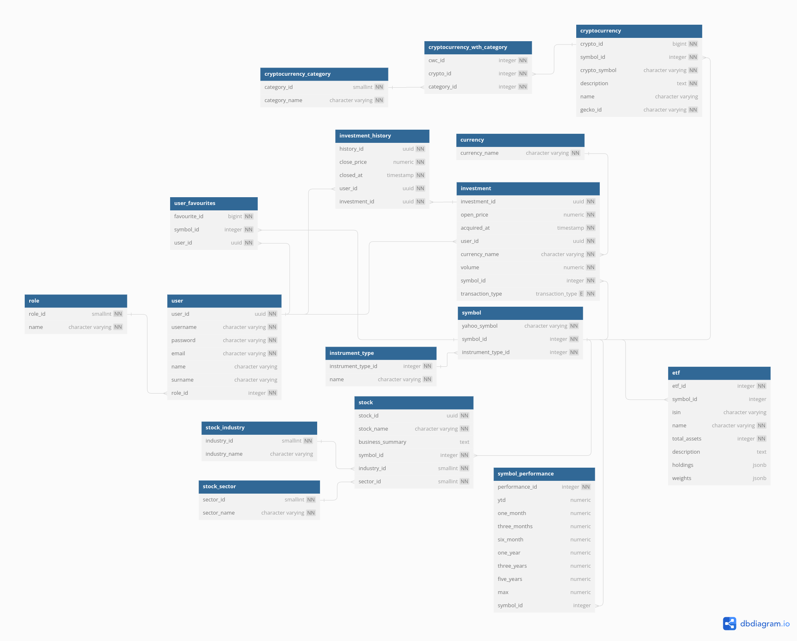

# ASSET-MATE

## Description

This is a web application that allows users to keep track of their invested financial instruments.

It has builtin support for tracking ETFs, stocks and cruptocurrencies with data from real market.

Users can read news about various topics that are fetched from google news.

## Database

## Screenshots

### Login page

### Register page

### Home page

### Invest page

